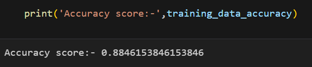
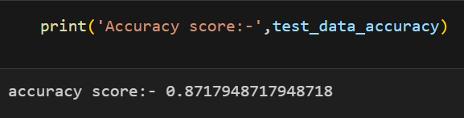

# 🧠 Parkinson’s Disease Detection using Artificial Neural Network

This project uses biomedical voice measurements to detect Parkinson’s disease using a neural network classifier built with Keras and trained on the UCI Parkinson’s dataset.

---

## 📊 Dataset

- Source: [UCI Machine Learning Repository](https://archive.ics.uci.edu/ml/datasets/parkinsons)
- Features: 22 biomedical voice measurements
- Target: `status` (1 = Parkinson’s, 0 = Healthy)

---

## 🔍 Project Summary

| Stage         | Details                                    |
|---------------|--------------------------------------------|
| Model Type    | Artificial Neural Network (ANN)            |
| Framework     | TensorFlow + Keras                         |
| Accuracy (Train) | **88.46%**                              |
| Accuracy (Test)  | **87.17%**                              |
| Evaluation    | Accuracy, Loss, Confusion Matrix           |

---

## 📈 Results

### Accuracy Over Epochs

### Loss Over Epochs

---

## 🛠️ Libraries Used

- `numpy`
- `pandas`
- `matplotlib`
- `scikit-learn`
- `tensorflow` / `keras`

Install all dependencies:
